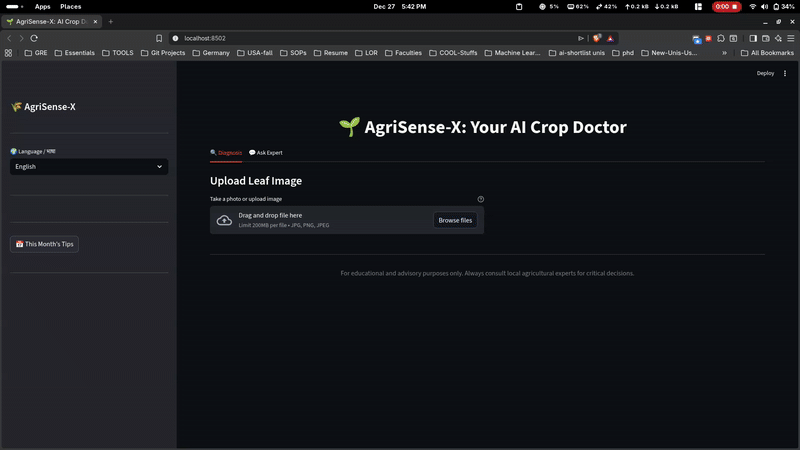

# 🌱 AgriSense-X: Explainable Multimodal Crop Disease Detection & Advisory System

> An AI-powered agricultural assistant combining Computer Vision and Large Language Models to provide intelligent crop disease diagnosis with actionable treatment advice.

## 🎯 Project Highlights

### What Makes This Special?

1. **Explainable AI** - Not just predictions, but visual explanations using GradCAM showing exactly where the AI is looking
2. **Conversational Expert** - Chat with Claude AI for follow-up questions about treatments, costs, and concerns
3. **Multilingual Support** - Advice in English, Hindi and Nepali for broader farmer accessibility
4. **Treatment Timeline** - Actionable checklists and progress tracking
6. **Low-Confidence Alerts** - Differential diagnosis for uncertain predictions

## 🏗️ Architecture

```
┌─────────────────────────────────────────────────────────────┐
│                    AgriSense-X System                        │
├─────────────────────────────────────────────────────────────┤
│                                                               │
│  ┌───────────────┐    ┌──────────────┐    ┌──────────────┐ │
│  │   Image       │───▶│  MobileNetV2 │───▶│  Disease     │ │
│  │   Upload      │    │  Classifier  │    │  Prediction  │ │
│  └───────────────┘    └──────────────┘    └──────────────┘ │
│                              │                      │         │
│                              ▼                      ▼         │
│                       ┌──────────────┐    ┌──────────────┐  │
│                       │   GradCAM    │    │  Claude AI   │  │
│                       │ Explainability│   │   Advisory   │  │
│                       └──────────────┘    └──────────────┘  │
│                              │                      │         │
│                              ▼                      ▼         │
│                       ┌─────────────────────────────────┐   │
│                       │    Streamlit Web Interface      │   │
│                       │  • Visual Explanations          │   │
│                       │  • Conversational Chat          │   │
│                       │  • Multilingual Support         │   │
│                       │  • Analytics Dashboard          │   │
│                       └─────────────────────────────────┘   │
└─────────────────────────────────────────────────────────────┘
```

## 📁 Project Structure

```
AgriSense-X/
├── model/
│   ├── train.py             
│   ├── predict.py           
│   ├── gradcam.py           
│   └── model.pth             
│
├── llm/
│   └── advisor.py            
│                             
│
├── data/
│   └── plantvillage/         
│       ├── Tomato___Late_blight/
│       ├── Potato___Early_blight/
│       └── ...
│
├── app.py                   
├── requirements.txt         
└── README.md                
```

## 🚀 Setup Instructions

### 1. Install Dependencies

```bash
pip install -r requirements.txt
```

### 2. Configure Claude API

Get your API key from: https://console.anthropic.com/

Add to `llm/advisor.py`:
```python
client = anthropic.Anthropic(api_key="your-api-key-here")
```

Or set as environment variable:
```bash
export ANTHROPIC_API_KEY="your-api-key-here"
```

### 3. Create model

To save the model run:
```python
model/train.py
```

### 4. Run the Application

```bash
streamlit run app.py
```

The app will open at `http://localhost:8501`


## 📊 Technical Metrics

- **Model**: MobileNetV2 (efficient, deployable)
- **Training**: PlantVillage dataset (15 disease classes)
- **Accuracy**: 
    ```
    Epoch 1 Loss: 0.2485
    Epoch 2 Loss: 0.0417
    Epoch 3 Loss: 0.0258
    Epoch 4 Loss: 0.0142
    Epoch 5 Loss: 0.0169
    ```
    Loss decreased by 93% from epoch 1 to 5, showing excellent convergence. The slight increase in epoch 5 suggests we could benefit from early stopping or learning rate scheduling for deployment.

- **Explainability**: GradCAM attention visualization
- **Languages**: 4 (English, Hindi, Nepali)
- **Advisory**: Context-aware using Claude Sonnet 4


## 📚 References for Your Report

- PlantVillage Dataset: https://www.kaggle.com/datasets/emmarex/plantdisease/data
- GradCAM Paper: https://arxiv.org/abs/1610.02391
- MobileNetV2: https://arxiv.org/abs/1801.04381
- Claude Technical Details: https://www.anthropic.com/claude
- Agricultural Disease Impact: FAO Reports on Crop Loss


## 🎬 Demo Video


